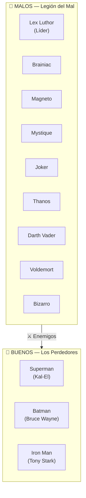

# Esquema: Buenos vs Malos

## Resumen

| Lado     | Miembro     | Identidad           | Universo     | Nivel de amenaza para la Legión |
| -------- | ----------- | ------------------- | ------------ | ------------------------------- |
| 🦹 Malo  | Lex Luthor  | —                   | DC           | —                               |
| 🦹 Malo  | Brainiac    | —                   | DC           | —                               |
| 🦹 Malo  | Magneto     | —                   | Marvel       | —                               |
| 🦹 Malo  | Mystique    | —                   | Marvel       | —                               |
| 🦹 Malo  | Joker       | —                   | DC           | —                               |
| 🦹 Malo  | Thanos      | —                   | Marvel       | —                               |
| 🦹 Malo  | Darth Vader | Anakin Skywalker    | Star Wars    | —                               |
| 🦹 Malo  | Voldemort   | Tom Riddle          | Harry Potter | —                               |
| 🦹 Malo  | Bizarro     | —                   | DC           | —                               |
| 🦸 Bueno | Superman    | Kal-El / Clark Kent | DC           | 🔴 CRÍTICO                      |
| 🦸 Bueno | Batman      | Bruce Wayne         | DC           | 🔴 CRÍTICO                      |
| 🦸 Bueno | Iron Man    | Tony Stark          | Marvel       | 🟠 ALTO                         |

## Notas

- **Superman** es el mayor obstáculo: invulnerable salvo Kryptonita y magia. Lex tiene la mayor reserva de Kryptonita.
- **Batman** no tiene poderes, pero ha derrotado a más villanos que Superman. Siempre tiene un plan de contingencia.
- **Iron Man** no es prioridad de combate, pero su tecnología (JARVIS, sistemas Stark) es la mayor amenaza pasiva.
